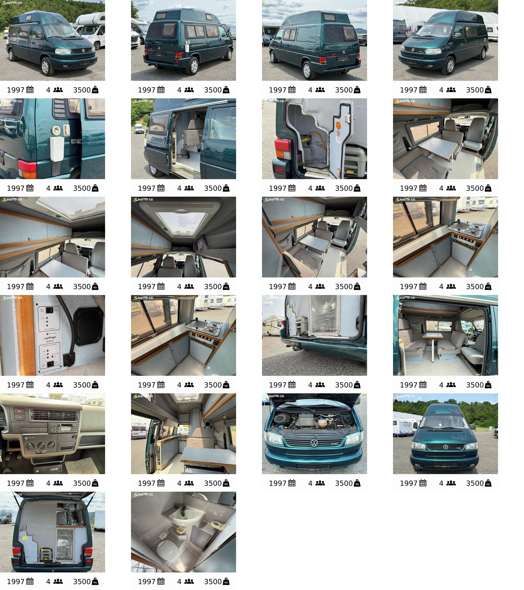

# Reference: VW T4 Carthago Malibu (1997, 2.5 TDI) — for sale

**Status:** listing saved, factory specs researched (2026-09-26). Not seen in person.

A ready-made 29-year-old camper van, for sale at a dealer near Beroun. Kept here as a
**buy-instead-of-build** data point: what a small factory camper gives you, and what it costs.

## Read in this order

| Layer | File | What is in it |
|---|---|---|
| 1 | **this page** | the short answer: what it is, key numbers, verdict |
| 2 | [listing.md](listing.md) | the dealer's listing word for word (Czech + English), price, seller, photos |
| 3 | [vehicle.md](vehicle.md) | the VW base vehicle: VIN, engine, gearbox, size, weights, driving, ground clearance, emissions |
| 3 | [living.md](living.md) | the Carthago fit-out: layout, beds, water, gas, heating, fridge, electrics |
| 4 | [service.md](service.md) | how often it needs a garage, costs, and against the La Strada listings |
| 4 | [checks.md](checks.md) | weak points and what to check before buying |
| 4 | [electrics-upgrade.md](electrics-upgrade.md) | how to make it an office: lithium, DC-DC, portable solar — parts, cost, wiring |
| 4 | [market-de.md](market-de.md) | the Malibus **with washroom** for sale in Germany (2026-09-26) — 5 vans, one complete 32.2 |
| 4 | [rehhorst-32/](rehhorst-32/README.md) | the best German alternative: Malibu 32 (32.3?), 1996, 263,000 km, €13,400 — against this van |
| 4 | [vs-our-plan.md](vs-our-plan.md) | this van against our Crafter L3H3 plan and against [about-us](../../doc/about-us.md) |

**How sure are the numbers?** Every row says where it comes from:

| Label | Meaning |
|---|---|
| **seen** | visible in the dealer's photos |
| **listing** | the dealer wrote it |
| **VW** | VW factory document (body builder guide) |
| **typical** | true for this model in other listings or owner forums — probably true here too |
| **guess** | our best guess, not confirmed |

## What it is

| | |
|---|---|
| Vehicle | **VW T4 Transporter, long wheelbase (3320 mm)**, 1997, VIN WV1ZZZ70ZVH088958 |
| Engine | **2.5 TDI, 5 cylinders, 75 kW / 102 PS**, 250 Nm, 5-speed manual, front-wheel drive |
| Mileage | **380,000 km** |
| Conversion | **Carthago Malibu 32**, most likely the **32.3** layout: GRP high roof with **lockers, no roof bed**, rear washroom, rear kitchen (≈ 200 built). First read as a 32.2 — corrected by Ondrej 2026-09-26 |
| Price | **369,000 CZK** (≈ €14.7k) on Sauto; 399,000 CZK seen in a search snippet of the dealer's own page |
| Seller | Karavany365, Tovární 150, 267 01 Trubín (Beroun) |
| Links | [dealer page](https://karavany365.cz/product/vw-t4-carthago-2-5-tdi) · [Sauto listing](https://www.sauto.cz/obytne/detail/carthago/ostatni/208629503) |

## Key numbers

| | Value | Source |
|---|---|---|
| Length × width × height | **≈ 5,100–5,200 × 1,840 × 2,750 mm** | typical / VW |
| Width with mirrors | 2,175 mm | VW data |
| Standing height inside | **≈ 1.85 m** (Ondrej is 1.71 m — fits) | typical |
| Ground clearance | **≈ 150 mm** | T4 data |
| Turning circle | 12.9 m | T4 data |
| Max weight (GVW) | **probably 2,730 kg** — the dealer's "3.5 t" is almost surely wrong | VW / listing |
| Real payload | **probably 300–450 kg** — must weigh it | typical |
| Seats with belts / berths | 4 / 2 listed (factory: 2 in the roof + 2 below) | listing / typical |
| Fresh / grey water | **≈ 50–75 L / ≈ 50–56 L**, both under the floor, electric frost heaters | typical |
| Hot water | Truma gas boiler ≈ 10 L | typical |
| Heating | Truma gas, ≈ 2.4 kW (Trumatic E 2400) | typical |
| Fridge | Electrolux RM 185, ≈ 45 L, 3-way absorption (gas / 12 V driving / 230 V) | typical |
| Toilet | Thetford C-200 cassette, ≈ 17 L | typical |
| Gas | 2 × 5 kg bottles, rear locker, 30 mbar | seen / typical |
| Electrics | Schaudt EZ 90 box + LA 110 charger, 1 leisure battery ≈ 60–100 Ah lead-acid, no solar | seen / typical |
| Fuel / consumption | 80 L tank, ≈ 10 L/100 km | VW data |
| Emissions | **Euro 2** — red sticker in German low-emission zones | T4 data |

## Short verdict

- **Good:** complete, legal, small, cheap, easy to park, a real washroom with a cassette WC and
  shower, gas heating and hot water, standing room under the high roof. The 32.x (with washroom) is
  the wanted Malibu family. Price is mid-market for the German range.
- **Bad for us:** **no room to work** — no desk, one small dinette; **tiny battery and no solar**
  (a laptop day would empty it — fixable for ≈ €1.3–1.7k, see [electrics-upgrade.md](electrics-upgrade.md)); **payload is small**; **Euro 2** keeps it out of German city
  zones; **380,000 km**, 29-year-old seals, windows with no spare parts.
- **In one line:** a good weekend or holiday camper, **not a 6-month office.** Details in
  [vs-our-plan.md](vs-our-plan.md).

## Photos

22 dealer photos in [photos/](photos/), 1024 px, named by what they show. The ones that tell
the most:

| Photo | Shows |
|---|---|
| [12-kitchen-sink-hob](photos/12-kitchen-sink-hob.jpg) | L-shaped kitchen, sink + 2-burner hob combo, fridge below |
| [13-schaudt-panel-tanks-batteries](photos/13-schaudt-panel-tanks-batteries.jpg) | Carthago / Schaudt panel: 2 tank tests, 2 battery tests, "Panel 230-1" |
| [16-dinette-from-sliding-door](photos/16-dinette-from-sliding-door.jpg) | the dinette on the driver side, swivel cab seats |
| [18-interior-looking-aft](photos/18-interior-looking-aft.jpg) | from the sliding door: kitchen block on the left (passenger side), dinette on the right, washroom at the back |
| [21-tailgate-open-rear-wall](photos/21-tailgate-open-rear-wall.jpg) | behind the tailgate: gas locker, WC cassette, plumbing |
| [22-washroom-wc-basin](photos/22-washroom-wc-basin.jpg) | Thetford cassette WC, corner basin, shower tray |
| [09-roof-bunk-and-overhead-lockers](photos/09-roof-bunk-and-overhead-lockers.jpg) storage over the cab (not a bed — see the correction) |
| [05-driver-side-truma-flue-vents](photos/05-driver-side-truma-flue-vents.jpg) | Truma flue and vent covers on the outside |
