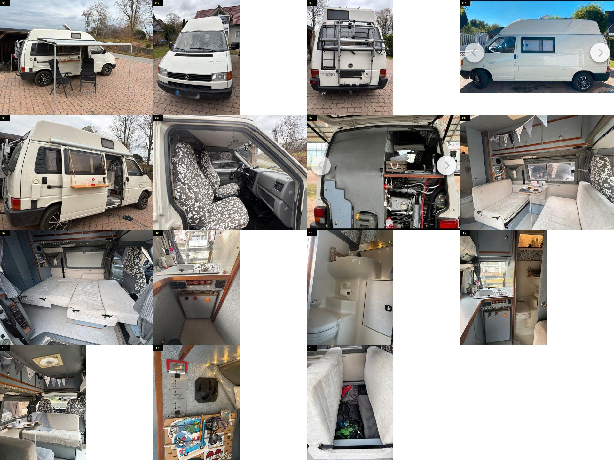

# Rehhorst — VW T4 Carthago Malibu "32", 1996, 1.9 TD

[← back to the market list](../market-de.md) · [← back to the Czech van](../README.md)

Found by Ondrej on mobile.de, 2026-09-26. The same ad is on kleinanzeigen (contact goes through
mobile.de). mobile.de blocks us, so the text below is from the **kleinanzeigen copy**. Photos:
15 from the ad, in [photos/](photos/).

## Where

| | |
|---|---|
| mobile.de | https://suchen.mobile.de/fahrzeuge/details.html?id=460748912 |
| kleinanzeigen | https://www.kleinanzeigen.de/s-anzeige/volkswagen-campingbus-vw-t4-carthago-malibu-32/3459890539-216-23218 (ad 3459890539, posted 15.07.2026) |
| Seller | **private**, 23619 Rehhorst (Schleswig-Holstein, between Hamburg and Lübeck). Selling because they are "upsizing" |
| Price | **€13,400, negotiable** (≈ 335,000 CZK) |

## Key facts

| | Value | Source |
|---|---|---|
| Model | **Carthago Malibu 32** (badge on the tailgate). Most likely **32.3**: compact high roof, **no roof bed**, lockers at the front, **2 berths** (the dinette bed) | ad + seen |
| First registered | **02/1996** | ad |
| Mileage | **263,000 km** | ad |
| Engine | **1.9 TD, 50 kW / 68 PS**, manual. "Not the strongest, but does 110–120 km/h, and the TD counts as one of the reliable ones" | ad |
| Front | **short nose** (pre-facelift) | seen |
| Length | **5.05 m**, long wheelbase | ad |
| Colour | white, cloth interior | ad |
| Condition | **accident-free**, non-smoker, **kept in a covered hall** (by them and the owner before) | ad |
| TÜV / gas check | **both valid to 05/2028** | ad |
| H plate | possible | ad |
| Seats | **6**, all with belts | ad |
| Berths | 2 | ad |
| Chassis | ABS, power steering, **tow bar** | ad |
| Wheels | alloys | seen |
| Weight / GVW | **not stated** — ask | — |
| Emissions | not stated. A 1996 1.9 TD is Euro 1 or 2 — ask for the papers | guess |

## Living part

| | Value | Source |
|---|---|---|
| Washroom | **own door**, washbasin, shower, **cassette WC removed from the rear** | ad + seen |
| Kitchen | 2-burner gas hob + sink, **45 L fridge** (ad says 220 V; it is the 3-way Electrolux) | ad + seen |
| Fresh / grey water | **75 L / 50 L** | ad |
| Hot water | boiler | ad |
| Heating | **Truma gas heater with timer** | ad |
| Gas | locker for **2 × 5 kg** | ad |
| Air | **roof fan, blows in or out** (seen on photo 13) — the Czech van has none | ad + seen |
| Storage | "very much": multi-function bench system, many lockers | ad + seen |
| Electrics | Carthago / Schaudt panel (photo 14), a small extra display above it | seen |
| Extras | **awning with side panel**, Bluetooth radio, airbag, **reversing camera**, **bike rack** (Thule, on the tailgate), **roof ladder**, Bearlock gear lock | ad + seen |

## Against the Czech van

| | **Rehhorst 32** | **Czech van (32.2)** |
|---|---|---|
| Price | **€13,400 VB** | ≈ €14,700 (369,000 CZK) |
| Year | 1996 | 1997 |
| Mileage | **263,000** | 380,000 |
| Engine | 1.9 TD, **68 PS** | **2.5 TDI, 102 PS** |
| Roof | compact high roof, **no roof bed** | high roof **with roof bed** |
| Berths | 2 | 2 listed, 4 from the factory |
| Seats | 6 | 4 |
| Washroom, tanks, heater, fridge | same Carthago kit, **75 / 50 L stated** | same kit, tanks not stated |
| Roof fan | **yes** | no |
| Extras | awning, bike rack, reversing camera, roof ladder | cab A/C |
| Condition story | private, hall-kept, accident-free, TÜV to 2028 | dealer, free gas + electric revize, handover demo |
| Buying | in Germany: travel ≈ 700 km, export plates, CZ registration | in Beroun, already CZ papers |

**In short:**

- **Rehhorst is better kept and cheaper**, with 117,000 km less, and has the roof fan and the
  bike rack we would want.
- **The Czech van has the better engine** (50 % more power) and the **roof bed**. The roof bed
  matters for a family of three: with only the dinette bed, the kid has nowhere of their own.
- For us the roof bed + TDI are the reasons to prefer the 32.2; the Rehhorst van is the
  **safer car**.

## Questions for the seller

1. Is it a **32.3** (no roof bed)? A photo of the Carthago plate.
2. **GVW** in the papers (F.1 / F.2) and **empty weight** if weighed.
3. Emissions class / key number (Euro 1 or 2?) and sticker.
4. **Timing belt** and water pump: when, at what km? Proof?
5. Roof joint and windows: ever leaked? Any cracks?
6. Rust repairs done? Photos of the sills and the sliding-door bottom.
7. Leisure battery: type, age, Ah. Any solar?
8. Heater, boiler, fridge on gas: all working? Last gas check was when?
9. Service history, number of owners.
10. Would they accept a buyer from CZ with export plates?
