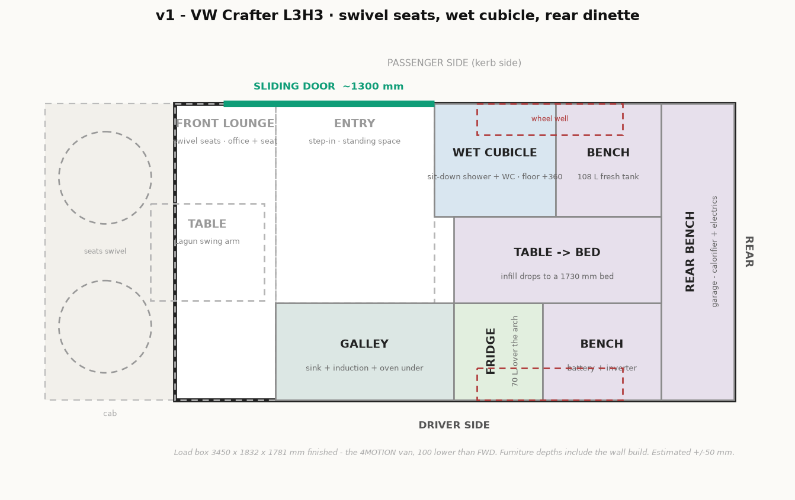
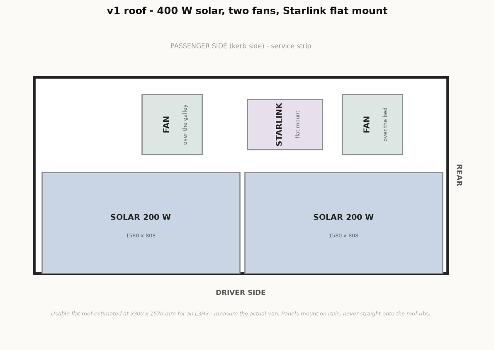

# v1 — VW Crafter L3H3

**Drawn on the 4MOTION van since 2026-09-23:** finished ceiling **1781**, 100 mm under the
front-wheel-drive van (VW brochure: 1861 vs 1961 raw). Overhead lockers top out at 1700,
the shower head at 1760, and full-height parts follow the ceiling.

Configuration settled in the grilling session on 2026-09-17. Read
[doc/about-us.md](../doc/about-us.md) first — it explains why this build is minimal on
storage and water but heavy on daily working comfort.

Drawings: `layout.png` / `.svg` (plan), `views.png` / `.svg` (elevations + sections).
Regenerate both with `python plan.py v1` from the project root.

## Roof

 — `roof.png` / `.svg`, regenerate with `python plan.py v1-roof`.

**400 W fits, with room left over.** Usable flat roof on an L3H3 is about **3300 x 1570 mm**
(derived from the 148" EL figure of 3.66 x 1.57 m, less the 723 mm L4-to-L3 difference —
**measure the real van before ordering**).

- **Driver side, 808 mm strip:** two 200 W panels end to end, 1580 x 808 each = 3160 mm of
  the 3300 available.
- **Passenger side, 762 mm service strip:** both Maxxair fans (480 x 480 with flange) and the
  Starlink flat mount (~600 x 400), with clear gaps between them. Servicing happens from the
  kerb, not from the traffic side.
- Fan positions follow the interior: one over the galley (x ~1100), one over the bed (x ~2700),
  far enough apart to actually cross-flow.
- There is a ~860 mm gap at the front of the service strip. A 50 W panel fits there if we want
  450 W, but it is not worth the extra MPPT string.

Panels go on rails or crossbars, never straight onto the roof ribs.

## 3D and impressions

- **[Interactive 3D viewer](https://claude.ai/artifact/77kssSuBvxoTHCrQmxq97y#v1)** — orbit the
  layout in a browser. Four preset views, and you can switch off the bed, the cubicle, the
  lockers, the appliances or the shell to see past them. Built from the same box data as
  the plan. Local copy: `viewer.html` (regenerate with `python model3d.py v1`). The model
  includes the van body itself — apertures cut for the sliding door, rear doors, windows and
  roof fans, plus glazing and the cab with its swivel seats, dash and windscreen — and the
  big kit at its real catalogue size.
  - **Sizes** turns on a label on every block: what it is, and its width × depth × height
    in mm. Off by default, because 30 labels at once is unreadable. Turn off the layers you
    are not measuring and it becomes useful.
  - **Appliances** shows the oven, hob, sink, cassette, both tanks, the calorifier, the
    batteries and the inverter — and **ghosts the carcasses that contain them** (galley, wet
    cubicle, both benches) so you can see inside. Their edges stay crisp, so the carcass still
    reads as a box. Switch the layer off and the cabinets go solid again. Switch off
    *Bed made up* too, or the made-up bed covers the benches from above.
- `model.obj` — the whole layout as solid geometry, metres, Y up. Opens in Blender or SketchUp.
- `3d/*.png` — greybox renders from four cameras, generated from the same box data as the plan.
- `3d/control/*.png` — edge-only renders used to steer the image generator.
- `impressions/*.jpg` — photoreal interior views (`python impressions.py v1`).
- `impressions/*.png` — an earlier, uncontrolled set. Kept only for comparison; ignore them.

**How the impressions are made.** `model3d.shaded_render()` draws the van from a camera placed
by hand inside it — the real body panels with their apertures cut, one flat colour per material
— and that image goes to FAL's **depth-conditioned** FLUX (`fal-ai/flux-control-lora-depth`) at
control strength **0.75**. The prompt supplies materials and light.

This replaced canny-on-a-line-drawing, which could never do both jobs at once: loose enough to
look photographic and it furnished the empty entry with sofas; tight enough to hold the layout
and it looked like a CAD render. Depth carries the *volume* of the room rather than just its
edges, so there is nothing left for the model to guess about what a blank area means. The full
ladder of everything tried, with sample images, is in
[doc/README.md](../doc/README.md#tooling) and `v1/impressions/ladder/`.

Three things that went wrong along the way, all still worth knowing because the renderer is
the same one:

**The camera was outside the van the whole time.** This is the bug that made every impression
wrong, and it hid for three rounds. `line_render` used to use matplotlib's 3D axes, whose
camera always sits a fixed distance from the centre of the data box — 10 × focal_length in
normalised units. For the Crafter that put the "from the bed looking forward" eye **1324 mm
behind the rear doors**, and the "through the sliding door" eye 2155 mm outside the passenger
wall. All four cameras were exterior views of a wireframe box, so the model had almost nothing
to go on and invented the interior. Shortening the focal length to pull the eye inside only
trades the problem for starbursts, because mplot3d never clips at the near plane.

The fix was to stop using it. `line_render` now does its own pinhole projection: you give it
an **eye and a target in millimetres**, it clips against a near plane, and it paints solid
white faces back to front so nearer furniture actually hides what is behind it. Two older
failure modes disappear with it — the frame is now exactly 4:3 by construction, so nothing
needs padding, and there is no orbit camera to wander off.

**The control images were mirrored.** Plan coordinates are **left-handed** — x runs aft, y
runs toward the driver side, z is up, and the plan is drawn from above with y pointing *down*
the page. `numpy.cross` is right-handed, so building the camera basis straight from plan
coordinates flipped every control image. The galley came out on the right of the "looking
forward" shot when it belongs on the left. `_basis` now negates y first, which makes the world
right-handed, and the standard camera maths is then correct.

On top of that, left and right have to be worked out from the camera, not from the plan: the
plan is drawn nose-left, so its *top* edge is the driver side, and looking aft flips left and
right again. Two of the four prompts had the galley on the wrong side, so the text fought the
control image and the model split the difference. Each shot now carries a comment saying which
way screen-right points, and `impressions.check_sides()` asserts it before anything is
generated — it fails loudly if the mirror ever comes back.

**Wireframe lines used to paint over the furniture.** The room outline and the openings were
drawn last, so the room's far corners were stroked straight across the galley and fed the
canny map edges that are not really visible. Lines and faces are now sorted together by depth,
so a nearer white face hides what is behind it.

**Always look at a control render after changing a camera.** They are kept in `3d/control/`
for exactly that.

**Never write a negation into the prompt.** "No tall cupboards beyond the kitchen" produced a
tall cupboard beyond the kitchen; "not a 3D render" in the style block was helping keep them
flat. Diffusion models have no "not". Say what *is* there instead — "two low benches facing
each other under a window" — and the wrong thing stops appearing. This single change fixed the
phantom wardrobe and turned the made-up bed from a dining table into a bed.

**They are still mood images, but they are now the right layout.** All four Crafter shots
place the galley, the cubicle, the door, the dinette and the cab where the plan puts them. What
is left is cosmetic: the model sometimes frames the whole van inside an invented doorway, and
it dresses surfaces with things we never specified. Judge materials, palette and feel from
these. Build from `layout.png` and `views.png`.

## Vehicle

- **VW Crafter L3H3, 4MOTION.** Load box **3450 × 1832 mm**, 1861 mm load height (1961 on FWD).
- Finished interior after floor and ceiling build: **3450 × 1832 × 1781 mm**.
- Buying in Czechia or Germany, converting in Czechia.
- Registered as a **motor caravan from the start** — furniture fixed, built to the EU
  definition (seating, table, sleeping accommodation, cooking facility, storage).
  Going gas-free removes the gas inspection. Confirm the process with DEKRA / TÜV SÜD CZ
  **before** building, not after.

## Plan

Zones, front to rear. x measured from the front bulkhead line.

| x (mm) | Driver side | Passenger side (kerb) |
|---|---|---|
| 0–620 | **front lounge** — cab seats swivel in, Lagun swing-arm table | front lounge |
| 300–1600 | — | **sliding door**, the entry |
| 620–1720 | **galley** 1100 × 600: sink, 2-zone induction, mini oven under, one drawer stack | open entry floor, 1232 mm of standing space |
| 1600–2350 | — | **wet cubicle** 750 × 700, door opens forward into the entry |
| 1720–2270 | **fridge**, 70 L drawer | cubicle |
| 2270–3044 | bench, battery + inverter under | — |
| 2350–3044 | — | bench, 110 L fresh tank under |
| 1720–3044 | — table between the benches, infill drops to the bed — | |
| 3000–3450 | **rear bench** across the doors, garage under, reached from the rear doors | |

- **Bed**: 1730 mm long. Full 1832 mm wide at the head end, narrowing to 1132 mm at the foot
  where the cubicle intrudes. Feet don't need the width.
- **Corridor** past the cubicle: 532 mm. **Entry / galley aisle**: 1232 mm.
- **The wet cubicle screens the sliding door from the whole rear half.** Ray-tested while
  debugging the impressions: from anywhere on the bed or the dinette, the cubicle is between
  you and the door opening — 0 of 3 sample points along the doorway are visible from the bed,
  and only 1 of 3 from the extreme driver side. So no daylight and no view reach the bed
  through the open side door, and the rear depends on its own two windows and the roof fan.
  That is the price of putting a full-height box on the kerb side; worth knowing before it
  is built, not after.
- Wheel wells (x 1863–2763) fall under the benches and under the cubicle — hence the
  cubicle's raised floor.

## Appliances

Real catalogue sizes, not placeholders — `model3d.py` asserts that every one of them sits
inside the van, inside a cabinet, and clear of its neighbours before it renders anything.
`python model3d.py v1` fails loudly if a size changes and stops fitting.

| Item | mm (w × d × h) | Where | Note |
|---|---|---|---|
| Induction hob, 2 zone | 300 × 520 × 15 | galley worktop, x 700–1000 | domino, not a full 590 unit — 1100 mm of run does not allow it |
| Sink | 400 × 340 × 150 | galley worktop, x 1120–1520 | single bowl, filter tap |
| **Mini oven, 20 L** | 450 × 350 × 340 | galley, under the hob, 380–720 above the floor | 230 V, ~1300 W |
| Pump, filter, trap | 340 × 350 × 360 | galley, under the sink | |
| Fridge, 70 L drawer | 550 × 600 × 450 | driver side, x 1720–2270 | Vitrifrigo DW class |
| Cassette WC | 420 × 570 × 500 | wet cubicle, on the +360 step | seat top 860 above the van floor, 500 above the step; hatch lines up at x 1750–2100 |
| Fresh water | 600 × 620 × 310 | under the passenger bench | ~110 L |
| Grey water | 700 × 500 × 200 | underslung, x 2100–2800 | ~70 L, clear of the AWD propshaft |
| Calorifier, 10 L | 300 × 400 × 300 | garage, passenger side | engine heat exchanger + 230 V element |
| Battery, 150 Ah × 2 | 270 × 520 × 230 each | under the driver bench, x 2320–2880 | 300 Ah total |
| Inverter 3000 W | 470 × 280 × 180 | shelf above the batteries, 270–450 | above, not on top of the cells |
| MPPT, DC-DC, fuses | 300 × 400 × 200 | garage, passenger side | board next to the calorifier |

**The oven costs us the galley drawers.** The galley run is 1100 mm. The oven takes 450 of it
and the sink cupboard takes another 340, which leaves a **single 220 mm drawer stack** under
the worktop. Everything else that used to live there moves to the garage or the lockers.

**Decided 2026-09-18: the built-in.** Ondrej confirmed the 20 L oven under the worktop over
an Omnia stovetop oven. The single 220 mm drawer stack is the accepted cost; galley storage
that used to live there goes to the garage and the overhead lockers. Order the oven before
the galley carcass is cut and build the aperture to the real unit, not to the 450 × 350 × 340
here — leave 20 mm of ventilation clearance on the sides and back, and put its socket on the
inverter circuit, not on a 12 V line.

**What the oven costs in power.** ~1300 W for 30 minutes is ~0.65 kWh, or ~55 Ah at 12 V —
about 20% of the usable battery per bake. Fine on a sunny day or after a drive, expensive on
a grey one. It is on the inverter, so it is a 3000 W-class load like the induction hob; do not
run both at once.

## Heights

| | mm above finished floor |
|---|---|
| Clear interior height | 1781 |
| Galley worktop | 900 |
| Bench top / bed platform | 450 (seat 520 with cushion) |
| Table | 760 |
| Overhead lockers | 1400–1700, 300 deep |
| Wet cubicle floor | +360 (clears the wheel arch outright, gives the drain its fall) |
| Garage clear height | ~400 |

## Systems

- **No gas, no diesel heater.** Induction cooking, plus a 20 L 230 V mini oven under the
  worktop — see the appliance schedule above for what it costs in drawers and in amp-hours. Hot water from an **engine heat exchanger**
  plus a 230 V immersion element for static days. Reserve a floor position and a fuel pickup
  path so a diesel heater can be retrofitted without rework.
- **Power: ~400 W solar** (roof is tight once two fans and the Starlink flat mount are placed —
  400 W is accepted), **300 Ah 12 V LiFePO4** (~3.8 kWh), **Victron MultiPlus 12/3000**,
  **50 A DC-DC**, shore inlet. **No Cerbo GX** — the Victron phone app covers it.
  Battery and inverter under the driver bench near the rear axle.
  Daily budget ≈ **2.6 kWh** (laptop 0.55, induction 0.8, hot water 0.6, fridge 0.45, rest 0.25);
  3.3 kWh on a Starlink day. **Regular driving is part of the plan** — the alternator covers
  roughly 0.6 kWh per hour and is the answer to cloudy weeks, not a fallback.
- **Water: ~110 L fresh** inside under the passenger bench, **~70 L grey underslung**,
  side-mounted alongside the frame rail (clears the AWD propshaft). 4–5 days between fills
  at our consumption.
- **Toilet: built-in cassette** (Thetford C223/C263) with an external service hatch.
  Sealed plastic, happy to be showered on.
- **Internet:** 4G/5G as primary and, outside the EU, as the only option. **Starlink is in the
  build but is EU-only** — it is not licensed in Turkey or Morocco, and that is accepted.
- **Work:** laptop stand, external keyboard and mouse. Optional 15" USB-C monitor on a small
  arm off the galley end panel — powered by the laptop, no power-budget impact.
- **Cooling:** two roof fans (one over the bed, one over the galley) for cross-flow, openable
  awning windows both sides, reflective covers for the windscreen and cab. No air conditioning.
- **Driver seat swivel** needs a handbrake lowering kit (Scopema / CTA, ~€100–200), and the
  handbrake must be released to turn the seat.

## Alternatives rejected, and why

The grilling session was mostly elimination. Recording it so we do not re-argue it.

**Vehicle**
- *L4H3 (jumbo)* — the reference van's layout drops straight in. We chose L3H3 anyway;
  everything below is the consequence.

**Bed**
- *Fixed crosswise bed* — needs ~1800 mm, the van gives ~1710 after the wall build. Only works
  with flare-out panels cut into the body (~€1500-2500, two holes in the van, resale hit).
- *Fixed lengthwise bed* — does not fit at all in 3450 mm once anything else exists.
- *Electric lift bed over the seating* — H3 height makes it feasible, but it is still crosswise
  so the same 1710 mm problem applies, plus €2000+, weight up high and a mechanism to fail.
- *Crosswise bed without flares* — 1710 mm means touching both ends at 171 cm. Ruled out.

**Bathroom**
- *Walled standing bath* — needs ~800 x 800 mm. With a 1730 mm bed there is nowhere for it:
  620 front lounge + 1100 galley + 1730 dinette is the whole van. The **sit-down** cubicle at
  750 x 700 is what made a bathroom possible at all.
- *Shower in the sliding-door entry* (ceiling curtain track, floor drain) — a bigger shower
  than any cubicle, and it stays as a fallback, but dropped once the cubicle fitted.
- *Outdoor shower only*, and *plan around campsites and gyms* — both fine for weekends,
  grim across six months.
- *Composting / dry separating toilet* — the solids bin must stay dry and we shower sitting
  on the toilet. Incompatible.
- *Dry-flush (Laveo)* — what the reference van used. Consumable cartridges add up over
  six months, and it is less happy being showered on than a cassette.

**Energy**
- *LPG for hob, hot water and heating* — costs a sealed locker in a 1100 mm galley, gas
  certification for the Czech camper registration, and adapters for every country's filler.
- *Diesel combi (Truma Combi D / Webasto Dual Top)* — ~€2500 for someone deliberately
  avoiding cold weather.
- *Air conditioning* — 400-1000 W means it only really runs on shore power, and a roof unit
  competes with the solar. It does not fit a 400 W system.
- *24 V electrical* — better engineering for an all-electric build, but every 12 V load then
  needs a converter. Not worth the annoyance at this scale.

**Layout**
- *Fixed desk* (as in the reference van) — replaced by swivelling the cab seats to a Lagun
  table, which costs no length at all.
- *90-100 L upright fridge* — ~860 mm tall, will not go under a 450 mm bench.
- *Top-loading fridge* — the most power-efficient option by a margin, rejected on daily
  access. Still the first thing to revisit if the budget bites.
- *Omnia stovetop oven instead of a built-in* — no build space, no extra power, and it would
  have kept the galley drawer bank. Rejected on 2026-09-18: it bakes bread and one-dish meals
  but does not roast, and you cannot use the hob while it is on.

## Changes forced after the grill

- **Fridge is a 70 L drawer unit, not a 90–100 L upright.** You chose "fridge under the dinette
  bench, galley stays whole". A 90–100 L upright is ~860 mm tall and will not go under a
  450 mm bench. A drawer fridge (Vitrifrigo DW-class, ~420 mm high) fits, and pulling out
  instead of swinging also solves the door-clearance problem in the 532 mm corridor.
  The cost is fridge volume. **Flagging this because it changes what you picked.**
- Shoe storage became a galley plinth drawer rather than a separate cupboard.
- Front table is a Lagun swing arm, not a pole socket.

## Open for v1

- Roof layout: two fans + Starlink + solar on a 3.1 × 1.55 m roof. Needs drawing to confirm
  400 W actually lands.
- Engine heat exchanger: **in the plan**. Ondrej to check it against the warranty later.
  Fallback if it is a problem: the 230 V immersion element alone.
- Budget: €10-15k target; realistic landing zone €13.7-17k. See [doc/budget.md](../doc/budget.md).
- Paperwork for Morocco and Turkey, and the Schengen limits for a Turkish passport — see
  [doc/about-us.md](../doc/about-us.md).

## Why the Crafter, decided 2026-09-20

v1 was drawn on a Ford Transit L3H3 first, with the Crafter carried alongside as a
comparison. The Crafter is now the base and the Transit is dropped. What the swap costs and
buys, at the same layout:

| | Transit L3H3 | Crafter L3H3 |
|---|---|---|
| Load length | 3494 | **3450** |
| Max width | 1784 | **1832** |
| Standing height | 1945 | **1881** (1781 on the 4MOTION van) |
| Bed length | 1774 | **1730** |
| Corridor past the cubicle | 484 | **532** |

The 48 mm of extra width lands in the corridor, which is the tightest spot in the van and the
one place a few millimetres are felt every day. The 44 mm of lost length comes off the bed,
which is the place with the most slack. The 64 mm of lost height is the real price, and it is
paid mostly in the wet cubicle — see the step note below.

Every decision above was made on the Transit and re-checked against this body:
`python model3d.py v1` asserts the whole appliance schedule fits before it will draw anything.
Nothing had to change. The non-dimensional arguments are in
[doc/README.md](../doc/README.md#alternative-base-vw-crafter-l3h3).

### Why the cubicle step is 360, decided 2026-09-20

The cassette has to touch the passenger wall — it is emptied through an external service
hatch — and that wall is where the rear wheel arch is. Moving the WC inboard breaks the hatch;
moving it forward puts it outside the cubicle. So the floor goes up instead, to 360, which
clears the arch outright.

The cost is headroom: 1781 − 360 leaves **1421 mm** standing height in the cubicle. That is
fine for the sit-down shower we planned and no good for standing under it. The shower head
went up with the floor, to a rail at 1140–1760, which is head height for someone sitting.

The alternative was to measure the real arch first. The tyre itself only reaches 112 mm above
the floor; the 350 mm we design around is an allowance for suspension travel that nobody has
checked on this vehicle yet. If it turns out lower, the step can come back down.
