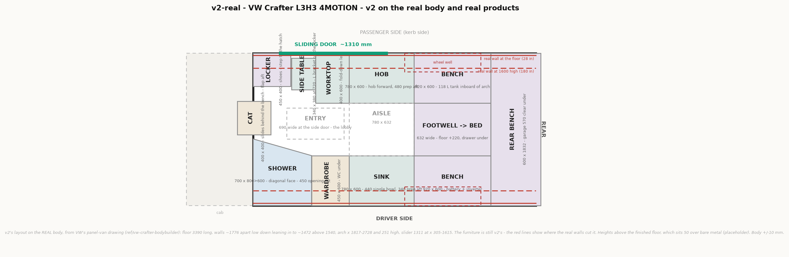

# v2-real — v2 on the real van

Started 2026-09-24 as a copy of [v2](../v2/README.md). v2 is a schema: a box van, placeholder
boxes, "+/-50 mm". v2-real is the same layout **on the real Crafter body**, with the wall
build-up we agreed, so it can become a plan to build from. **v2 is frozen.**

**Viewer:** the **Roof + fans** button (off by default) shows the roof with its real fan
cut-outs and the two MaxxFans on top, at their catalogue size.

**Open:** [sections.png](sections.png) — three cuts across the van (galley, dinette, garage):
finished walls black, bare rib faces grey, v2's old 1832 box dashed.

Regenerate: `python plan.py v2-real` then `python model3d.py v2-real`, from the project root.
It is also in the combined viewer: `python model3d.py viewer`.

## Where it lives

| File | v2-real block |
|---|---|
| `plan.py` | `VARIANTS["v2-real"]` — its own box list, and `body=`: the VW wall profile, arch, openings, and the build-up |
| `model3d.py` | the v2-real section — `HEIGHTS_V2R`, `EXTRA_V2R`, `APPLIANCES_V2R`, `SITTER_V2R`; the rest (windows, fans, partition, layers) is still v2's |

The frame is v2's: y against the old 1832 box lines, so the real centre line is at y 916 and
the walls stand inside 0 and 1832. A part that does not touch a wall kept v2's numbers.

**The body check is strict.** `python model3d.py v2-real` fails if any part — or any seated
person — runs into the finished walls, past the rear doors, or into the roof. Today: none.

## State on 2026-09-24 — v2's room, fitted to the real body

| | **v2-real** | v2 |
|---|---|---|
| Floor length | **3390** | 3450 |
| Between the finished walls: floor / 900 / from 1555 up | **1756 / 1693 / 1452** | 1832 |
| Finished height | **1811** (bare 1861 − 35 floor − 15 ceiling) | 1781 |
| Wheel arch | x 1817–2728, **266** high | 1863–2763, 350 |
| Slider | x 305–1615, 1687 high | 300–1600 |
| **Galley** | worktops **565** deep each side, aisle **562** | 600 / 632 |
| **Bed across** | **1744** (cushions 44–1788) | 1832 |
| Benches | 557 deep (wall side moved in 43) | 600 |
| Garage | **540** × 1746 × 570 | 600 × 1832 × 570 |
| Overhead lockers | **250** deep over the galley, **220** over the dinette, standing further into the room; the dinette pair 30 higher (110 over a seated head) | 300 / 260 from the box line |
| Wardrobe | 554 deep at the base (WC under it), back follows the lean above 775 | 600, square |
| Shower | 762 → 562 deep at the floor, wet lining follows the lean | 800 → 600 |
| Taps | 130 forward, to the back edge of the bowl | at the back of the deck |
| WC | **≤ 520 deep** (420 × 520 drawn), emptied **inside** — no body hatch | 420 × 570, hatch in the side panel |
| Grey tank | **95 L inside, under the raised footwell**; the spare wheel stays in VW's bay | 70 L underslung, on the rear differential |

**Two things the lean costs that are easy to miss:**

- **Seated people sit ~100 further into the room.** Your hips are on the cushion at the wall,
  but your shoulders meet the wall ~100 further in (at 1480 the wall is 176 in). So at the
  dinette the trunk, thighs and shins all move toward the table. The check now carries that.
  The table still clears the knees.
- **Up high, depth moves into the room.** Every locker is ~140 nearer the centre than in v2 to
  stay usable. Over the galley the locker front is at 1392 against a worktop front at 1197.

## Wall, floor and ceiling build-up — thin, agreed 2026-09-24

**The key fact:** VW's widths are measured to the **rib faces** (the lashing rails). Behind
the rib face there is a cavity of roughly **70–110 mm** to the outer skin (read from section
C-C). **Insulation goes in that cavity and costs no room inside.** What costs room is only
what sits *over* the ribs: a thermal break and the panel.

Our use sets the priorities ([about-us](../doc/about-us.md)): warm weather, no heater, Morocco
in winter, EU in summer. So the job is **keeping the sun out and stopping condensation**, not
holding heat in. The roof matters most; the walls need less than a winter build.

| Layer | **Thin (agreed)** | Standard | Battened |
|---|---|---|---|
| Wall cavity | closed-cell foam on the skin + fill — **0 inside** | same | same |
| Over the ribs | 3 mm thermal-break strip | 10 mm foam | 20 mm battens |
| Panel | 6 mm ply on rivnuts in the factory holes | 6 mm ply | 6 mm ply |
| **Wall, per side** | **~10** | ~16 | ~26 |
| Behind furniture | carcass back on the break strip, ~10 | ~16 | ~26 |
| Wiring | in the cavity and inside carcasses | same | behind the battens |
| **Floor** | 20 XPS between battens + 12 ply + 2 vinyl = **~35** | ~35 | ~35 |
| **Ceiling** | foam between the roof bows + 6 ply = **~15** | ~20 | ~30 |

What each option gives (bare numbers from the VW drawing):

| | Thin | Standard | Battened | v2-real today |
|---|---|---|---|---|
| Bed across (bare 1766) | **~1746** | ~1734 | ~1714 | — |
| Finished height (bare 1861) | **~1811** | ~1806 | ~1796 | 1781 (placeholder 50 + 30) |
| Standing on the 60 mm shower tray | ~1751 — **4 cm over Ondrej** | ~1746 | ~1736 | ~1720 |

**Why thin:** it is the cheapest in room exactly where the van is short (the bed across and
the galley aisle), and it gives back ~30 mm of headroom over the placeholder. It does not
insulate less: the insulation is in the cavity either way. What it gives up is a service
space behind the panels - the wiring runs in the cavity through the existing holes instead,
which is how most Crafter builds do it anyway.

**The galley "middle ground" with the thin build:** the wall at worktop height is 61 in from
v2's line, +10 cladding = 71. Splitting that between the carcasses and the aisle gives
worktops **~565 deep** each side and an aisle **~560** (v2: 600 and 632).

## Payload — the van is at its limit (first check, 2026-09-24)

`python payload.py` writes **[payload.md](payload.md)**: every item with its weight, its
source and its place along the van, against 3500 kg and the two axles.

| | Poplar furniture | Birch furniture |
|---|---|---|
| Van as sold (listing, incl. 75 kg driver, 90 % fuel) | 2440 | 2440 |
| Build: conversion + rough-road upgrades | 614 | 737 |
| Load: passenger, child, cat, full fresh water, gear, 3 bikes | 438 | 438 |
| **Total, with the proposed kitchen** | **3536** | **3659** |
| Rear axle (max 2100) | 2081 | 2181 |

**Read on that:**

- **We are 36 kg over 3500 with poplar, 159 over with birch.** Poplar furniture is not optional.
- **The rear axle is the tight one**, 2081 of 2100 — almost everything heavy sits over or
  behind it (water, batteries, garage, bikes on the rear doors). The split of the empty van is
  an assumption (53/47) until we weigh it.
- **The biggest unknown is the van itself.** 2440 is the listing; VW's minimum for this spec
  is 2182 and allows ±3-5 %. **Weigh the van, per axle, before the build** — it moves the
  answer by ±100 kg, more than anything we choose.

**What moves the number most:**

| Lever | Saves |
|---|---|
| Birch → poplar furniture | ~120 kg |
| Drive with ~40 L fresh water, fill at the stop | ~78 kg, nearly all off the rear axle |
| Bikes: every kg on the rear doors puts ~1.4 kg on the rear axle; e-bikes are ~25 kg each | 15–30 kg per bike |
| 200 Ah instead of 300 Ah battery | ~10 kg |

The furniture is estimated from the model's own boxes (±20 %); the passenger and child
weights are placeholders to confirm.

## Kitchen — proposed 2026-09-24

Isotherm Cruise 85 fridge, Bosch PIB375FB1E hob (limited to 2000 W), Quadron Anthony 50 sink
(440 x 440), Tefal Optimo OF4448 hot-air oven — see [products.md](../doc/products.md). In the
model: the fridge 85 L at the hob run's front, the sink 80 deeper with the **taps aft of the
bowl**, the oven 288 tall and 462 wide — which **fixes v2's oven running 20 mm into the sink
bowl**. The check now tests built sink parts against the appliances.

## Windows and fans — chosen 2026-09-24

From the product register ([doc/products.md](../doc/products.md), numbers in `products.py`).
The body check now also fails a window outside VW's stamped window fields, or a roof cut-out
over a known roof bow.

| | Product | Where (x, height above floor) |
|---|---|---|
| Over the sink | Dometic S4 500 x 350 | driver, x 1165–1665, z 1040–1388 — under the sink locker (1400) |
| Dinette, driver | Dometic S4 900 x 450 | x 1940–2842, z 1000–1448 |
| Dinette, passenger | Dometic S4 900 x 450 | x 1940–2842, z 1000–1448 — cross-flow over the bed |
| Front fan | MaxxFan Deluxe, cut 400 x 400 | x 560–960, centre line — VW's roof-hatch pressing, over the lobby |
| Rear fan | MaxxFan Deluxe, cut 400 x 400 | x 2200–2600, over the dinette — **bow positions to measure first** |

**Changed from v2:** v2 had four windows — one crossed the pillar between the two driver
fields, and three stood above the fields' top (~1473). **The shower window is gone for now**:
inside the field the shower is 470 wide, and the smallest S4 still sold is 500.

**What having no shower window costs** (the smallest S4 still sold is 500 wide; the shower is
470 inside the field):

| Lost | How much it matters |
|---|---|
| Daylight in the shower | little: a short shower in daylight is lit through the 450 opening from the lobby; LED strip for the rest |
| A direct vent for the steam | the real one. The front fan is ~150 from the shower's opening, and the curtain leaves the top open, so run the fan while showering. Condensation lands on the wet lining, which is made for it |
| A view | none worth having in a shower |

| Gained | |
|---|---|
| One hole less in the wall | no leak or rot point in the one wall that is always wet |
| €260–400 and a frame | |
| A continuous wet lining | simpler to seal |

**Decided 2026-09-24: no shower window** — the front fan does the job that matters.

**Also decided 2026-09-24:**

- **No window in the sliding door** — it gets a **fly screen** instead — chosen: the **VanQuito** magnetic net; the Horrex pleated door is
  made for the FWD door height (1822) and our 4MOTION opening is 1722. If a screen ever needs
  room: the shoe locker may shrink, the galley may not. See [products.md](../doc/products.md).
- **No cassette hatch in the body.** The WC's waste tank comes out **inside**, through a door
  in the wardrobe base on the lobby side, and is carried ~1 m to the sliding door. That was
  the only cut outside VW's window fields — no VW letter needed now. A portable WC with its
  own flush tank (e.g. Thetford Porta Potti 565E, 386 x 450 x 447) fits this best.

**Still open:** roof bows 2-3 and 5-6 — measure on the real van before cutting either fan hole.

## The grey tank — inside, under the footwell (agreed 2026-09-24)

**Why it moved at all:** v2 hung it under the middle of the van (x 2100–2800), which on a
4MOTION is the **propshaft and the rear differential**. VW's AWD underbody drawing leaves one
clear bay big enough — the **spare wheel's**, behind the rear axle — and the spare wheel has
to stay there: **the rear doors are kept free for a bike rack**, so there is no spare wheel
carrier on them, and the wheel (~711 across) does not fit anywhere inside.

| | |
|---|---|
| Where | under the raised footwell floor, x 1950–2830, y 616–1216, z 10–190 |
| Size | **880 × 600 × 180 = 95 L gross, ~85 usable** — custom tank |
| Sink | drains by gravity: bowl bottom ~700, tank top 190 |
| Shower | the tray drains at floor level, below the tank top: a **small shower drain pump** |
| Emptying | outlet through the floor at the tank's low point, valve under the van |
| Smell | sealed lid, vent to outside, trap on every inlet |
| Table post | can no longer bolt through the footwell floor: a small frame over the tank carries it |
| Lost | the footwell drawer, ~0.1 m³ |

**The spare wheel bay sets a limit on tyres.** It measures ~730 on VW's drawing for the 712
factory wheel. Bigger all-terrain tyres ([ref/offroad-upgrades](../ref/offroad-upgrades/README.md))
- 744 for 225/75 R16, 774 for 245/75 R16 - may not fit it, which would reopen this question.
Check with the real bay before choosing a tyre size.

The ready-made underslung Crafter tanks never fitted anyway: the Wydale 90 L and 63 L say
"does not fit LHD", the 90 L also "not MWB", and the 82 L runs down the centre where a
4MOTION has its propshaft.

## Where the spare wheel could go — the options we compared, 2026-09-24

The rear-door carrier is out: the rear doors are for a bike rack. The spare is a 235/65 R16: **~711 across,
~235 wide, ~25 kg**. VW's drawing also lists a temporary spare (Notrad) at 15–18.5 kg.

| | Option | Spare wheel | Grey tank | Costs | Verdict |
|---|---|---|---|---|---|
| **A** | **Grey tank INSIDE, under the raised footwell floor** | **stays in its bay, as VW made it** | ~880 × 600 × 180 = **95 L gross, ~85 usable**, x 1950–2830, y 616–1216 | the footwell drawer; a small shower drain pump; a frame for the table post | **chosen** |
| B | Two small tanks under the driver side, between the fuel tank and the rear axle | stays in its bay | 2 × ~26 = ~53 L | two tanks, more plumbing, next to the fuel tank and brake lines, 30 % less capacity | fallback |
| C | Spare on a tow-bar swing-away carrier | on the back, outside | spare wheel bay, 104 L | +~300 length, swing it away for every rear door opening, needs a tow bar | no |
| D | No spare — sealant + compressor | none | spare wheel bay | a torn sidewall on a Moroccan piste ends the trip | no |
| E | Inside: garage or bench | — | — | does not fit: garage 540 deep and 570 high, wheel 711 | impossible |

**Why A won:**

- **The spare stays where VW put it.** Nothing new hangs under the van; the carrier, the
  winch-down and the ground clearance stay as they are.
- **The tank sits in the best place in the van for weight:** low, on the centre line,
  between the axles. Full it is ~85 kg; the spare wheel bay is behind the rear axle.
- **The footwell is already lifted 220 for nothing but storage.** That drawer becomes the tank
  — and we have been cutting storage on purpose anyway ([about-us](../doc/about-us.md)).
- **Gravity still works for the sink:** the bowl bottom is at ~700, the tank top at ~190.
- **The shower tray drains at floor level**, below the tank top, so it needs a small shower
  drain pump either way. An underslung tank at the far end of the van would have needed a long
  falling pipe past the fuel tank instead.
- **Emptying:** an outlet through the floor at the tank's low point, valve under the van.
- **Warm-weather use means no freezing risk** — the usual argument for inside tanks, not against.

**What A costs, honestly:** the footwell drawer (~0.1 m³); a tank inside the living space
needs a sealed lid, a vent to outside and a trap, or it smells; and the table post can no
longer bolt through the footwell floor into the floor pan — it needs a small frame beside or
over the tank, or the tank splits into two either side of the post.

## The plan: from schema to buildable

Order matters: each step sets the limits for the next.

### 1. The real van body — done 2026-09-24

2026-09-24: VW's official body builder drawings are in
**[ref/vw-crafter-bodybuilder](../ref/vw-crafter-bodybuilder/README.md)**. The big findings:
the walls lean in (~1775 wide low down, ~1475 near the roof, not 1832), the floor is 3390 long
not 3450, the arch is 301 high, and **the grey tank as drawn sits on the rear differential**.
In the model, and v2's layout is fitted to it - see the state above.

| What | Why it matters |
|---|---|
| Wall slope (width at floor, 900, 1700) | the 600-deep galley and lockers lose width higher up |
| Ribs and pillars, positions along x | windows, WC hatch and fans must sit between ribs; furniture fixes to them |
| Real wheel arch shape | batteries have 16 mm, the fridge 83 mm — the real arch is curved, not a box |
| Real slider opening and step | lobby and entry are sized to it |
| **4MOTION underbody** | propshaft, exhaust, fuel and AdBlue tanks, spare wheel — does the underslung 70 L grey tank fit at all? **Biggest unknown.** |
| Roof ribs | fan cut-outs, solar rail feet |
| Cab bench | middle backrest folds? head restraint lifts out? — the crawl-through needs both |

Sources, best first: VW body builder guidelines for the Crafter (drawings; CAD data for
converters to be checked), then **measuring the real van** once bought — measured data
replaces brochure data.

### 2. Wall, floor and ceiling build-up — thin build agreed 2026-09-24

In the model as `floor_build`, `ceiling_build` and `clad` in `body=` (see above). Still to do:
the actual products per layer, and the 70–110 mm cavity depth checked on the real van.

### 3. Product register — started 2026-09-24

[doc/products.md](../doc/products.md) and `products.py`: windows and fans so far.

One entry per real product: brand + model, shop (CZ or EU), outer size, **required
clearances** (ventilation, service access, hose and cable exits), weight, price, power.
Appliance sizes then come from the register. The same data gives the v2-real budget, the
weight/payload check and the daily energy use.

| Priority | Item | Note |
|---|---|---|
| 1 | Windows (Crafter-specific), roof fans | they cut the metal |
| 2 | WC | fixed cassette vs portable — sliding into the shower is non-standard; max ~520 deep |
| 3 | Fridge 90 L, sink + tray, hob, oven | set the galley carcasses |
| 4 | Fresh and grey tanks | catalogue size, or a custom tank |
| 5 | Batteries, inverter, MPPT, DC-DC, calorifier, heater | need airflow and service access |
| 6 | Shower tray | probably custom — size it last |

### 4. From boxes to parts — not started

Panels at real board thickness → cut list; fixing points to ribs / rivnuts; wiring and
plumbing diagrams with lengths; cut-out drawings from body landmarks; check against Czech
motor-caravan homologation before building.
