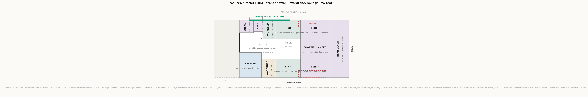

# v2 — VW Crafter L3H3, 3-seat cab

Started 2026-09-20. **Plan and 3D model — iterating.** No photoreal impressions yet.

Regenerate: `python plan.py v2` then `python model3d.py v2`, from the project root.

## The 3D model

**Viewer: [v2 Crafter](https://claude.ai/artifact/4zfKdrCzAheAzWhmKarVFe)** — drag to orbit,
scroll to zoom. Also written locally to `v2/viewer.html`, `v2/model.obj` and `v2/3d/*.png`.

Everything in it is extruded from the box list in `plan.py`, so the model cannot disagree
with the drawing above. What the 3D adds on top of the plan:

| Layer | What it holds |
|---|---|
| Bed made up | the infill over the footwell and the two pillows; hides the table and its post |
| Shower + wardrobe | the cubicle's panels, tray and carved face, and the wardrobe with the WC bay open |
| Worktop leaf out | deploys the galley's fold-down leaf; off, it hangs folded down the galley end |
| Door perch out | the fold-out seat by the sliding door; off, it hangs flat on the locker |
| Lockers | three overhead runs, kept clear of the door head and the windows |
| Appliances | the kit at real catalogue sizes, and it ghosts the carcasses so you see in |
| Body + glass | panels with real holes: slider, four windows, the cassette hatch, two fans, the partition with its pass-through |
| Cab + seats | the 3-seat cab, dash, wheel, and the four road wheels |
| Detailed props | generated meshes instead of coloured boxes — v2 adds its own for the wardrobe (open WC bay), the shoe locker, the hinged-door fridge, both taps and the inline filter. The sink, its insert tray and the shower cubicle are built from boxes instead: hollow things never survive a generated mesh |
| **Schema overlay** | the plan itself painted onto the model — pair it with the **Plan** view |
| Sizes | every block labelled with its name and size in mm |

`model3d.check()` passes on all 15 appliances: each one inside the van, inside a carcass,
clear of its neighbours, and clear of the tyres. Three results worth keeping:

- **The fresh tank crosses the bench-to-garage joint and is still housed**, because the U is
  one carcass. The check now accepts a run of carcasses that meet, not only a single box.
- **Nothing touches a tyre or a wheel arch.** The batteries sit 16 mm inboard of the driver
  tyre and the 90 L fridge stops 83 mm short of the arch — both are tight, and both are real.
- **Three seated people are part of the check.** The overhead lockers over the dinette failed
  it the moment the rear was lifted, which is how they came to move up rather than being
  found with a head in them later.

Brisa's layout ported to our van: shower in the front driver corner, galley split across the
aisle, rear U-dinette. See [ref/doracamper-brisa-ducato-l2h2](../ref/doracamper-brisa-ducato-l2h2/README.md).

## What changed from v1, and why

- **Three front seats** (driver + double bench), so **swivel seats are dropped**. They were
  never going to work against a 3-seat bench, and dropping them also removes the handbrake
  lowering kit and the "does the Crafter have an electronic parking brake" question.
- **Partition wall behind the cab at x = 0**, with a pass-through beside the shoe locker.
- **Three belted travelling seats** instead of two, which also makes the motor-caravan
  registration case simpler, not harder.
- **The bed turned sideways.** 1520 mm fore-aft is enough, even with a child, so you sleep
  **across** the van.
- **No office.** Dropped 2026-09-21. The front corner is a shoe locker and the galley's
  worktop carries on forward over it as a fold-down leaf.
- **The WC left the shower floor.** It stows under the wardrobe and slides forward into the
  shower only when needed — Scarlet & Seth's trick, adapted to a cassette.

## The dinette table, sized for two laptops

Two people opposite each other, offset, each with a laptop and a mouse:

| | |
|---|---|
| One station | 16" laptop 355 × 248 + mouse pad 200 × 180 + 60 forearm = **575 wide × 308 deep** |
| Head-on, two of them | needs 616 of depth; the van gives **632** — they fit, with the screens touching |
| Offset | two stations need 1150 of length; the table gives 900, so they **overlap by 230** and work diagonally |
| Table | **900 × 600** at **900**, 270 over the 630 seat |

Updated 2026-09-23. **It is back on a post, not a slide.** One tube standing on the raised
footwell floor, a flat plate under the top, and two collar positions: 900 to work and eat,
570 to drop the top onto the cleats and become the middle of the bed. The post stands at the
table's centre, x 2340–2440 — your feet go either side of it, which is why the two sitters in
`check()` are drawn offset along the van rather than opposite each other.

**900 is not an eating-table height by accident.** The whole rear is lifted, so the seat is
630 and the table has to be 270 above it. That lands on 900 — the galley worktop height, so
the two surfaces read as one level all through the van.

## The front corner, and the worktop leaf

No office here any more. What is left is a shoe locker, the step through to the cab, and
the galley reaching forward over it when you need prep space.

| | |
|---|---|
| Shoe locker | **450 × 400**, top at 450 — shoes inside, and the step to the cab |
| Door perch | **340 × 340** seat pad at 450, folding out of the locker's aft face |
| Worktop leaf | **400 × 600** at **900**, the galley's own height — fold-down |
| Mount | hinged on the hob unit's forward end panel, swing-out bracket under it |
| Folded | hangs flat down that same panel, x 1090–1150 |
| Cab pass-through | beside the locker, **432 wide**, in the bulkhead |
| Clear floor in front of the shower | **582** between the locker and the screen, up from 432 |

The locker earns two jobs from one box: shoe store, and the thing you put a knee on going
through to the cab. It lost 50 mm fore-aft and 150 mm across to give the lobby in front of
the shower more room.

**Turned a quarter clockwise, 2026-09-23** — 450 along the van, 400 across — and it grew a
**fold-out perch on its aft face**: a 340 × 340 pad at 450, level with the locker top, on one
folding leg. Sit on it facing **aft** down the van, or swing round and face the **driver
side**; with the pad down you and the locker make one 790 mm bench along the wall.

**Deployed, the perch stands in the step-in pocket** (x 450–790), so it has to be folded to
walk in or out. That is what the leg is for. The **Door perch out** button in the viewer
shows both states; deployed is the default.

**With the leaf down, the side door is blocked** — the clear entry drops from 690 mm to
about 290. It folds in a second, and unlike a table nobody is sitting at it, so the cost is
only while you are actually cooking.

Both positions are in the 3D model. **Folded is the default**, because that is the state the
entry gap assumes — the **Worktop leaf out** button deploys it.

`model3d.check()` carries **three seated people** — trunk, thighs and shins each: one on the
door perch turned to face the driver side, and the two at the dinette. The build fails if any
furniture runs through them. Two rounds of the old office table were drawn with a swing arm
through a sitter's chest before it was caught by eye, and the same test is what evicted the
old overhead lockers from above the dinette.

## Water at the sink

Resolved 2026-09-21. **Two bowls and two taps.**

| | |
|---|---|
| Sink top | one pressed **580 × 360** inset, two bowls side by side, 20 mm rim |
| Bowls | **239 × 304** each, 137 deep, 30 mm divider — detergent one side, rinse the other |
| Where | hard against the **wardrobe**, x 1150–1730 |
| Prep beside it | **200 mm × 600** of free counter aft of the sink |
| Mixer tap | over the wash bowl, the usual pumped cold and calorifier hot |
| **Drinking tap** | dedicated gooseneck beside the mixer, 250 above the worktop |
| Filter | **inline carbon block**, 2 × 10 inch, teed off the cold line after the pump |

**Why a separate tap and not a 3-way mixer:** filtered water never touches the mixer
cartridge or the hose that has been sitting in the tank, it is a third of the price, and a
failed mixer does not take the drinking water with it. Cost: one more 12 mm hole in the
worktop.

**Why an inline cartridge and not a sump housing:** there is 380 mm of height under the
bowls and a slimline sump needs about 400 to drop the cartridge out of it. An inline
cartridge is swapped by pulling its two hose fittings and can lie on its side — it sits
behind the oven at x 1600–1860, y 1700–1760.

### The drinking water parts, end to end

Five parts, roughly **€90–150** all in:

| | Part | Where |
|---|---|---|
| 1 | Gooseneck drinking faucet | one 12 mm hole beside the mixer, x 1620–1670, 250 above the worktop |
| 2 | Inline carbon block, 2 × 10 inch, quick-connect | behind the oven, x 1600–1860, y 1700–1760, lying on its side |
| 3 | T-piece on the cold line, **after the pump** | the filter needs pressure behind it |
| 4 | Shut-off valve before the filter | so a cartridge change is not a system drain |
| 5 | 8 or 10 mm hose | pump → valve → filter → tap |

**No extra power, and no extra pump.** The 12 V diaphragm pump at 1.5–2 bar pushes a carbon
block fine. You get about **1.5 l/min** at that tap instead of 4 — which is what a drinking
tap should give anyway.

**Cartridge grade — still to decide.** A 0.5 micron carbon block with bacteriostatic silver
covers taste, particulates and most bacteria, which suits filling from campsite taps. Add a
sediment pre-filter only if we expect doubtful sources. Swap every 6–12 months or ~3000 L.

**What this does not solve.** The filter protects what comes out of the tap, not what grows
in the tank. A tank left full and warm for weeks still needs cleaning out — the filter only
means we are not drinking the result.

### Where the prep space comes from

Updated 2026-09-23. 780 mm of run cannot hold two bowls **and** a prep area, so the sink went
down to **one deep bowl with a drop-in tray** — the second compartment only exists when you
want it, and the counter is free the rest of the time:

| Run | Kit | Free counter |
|---|---|---|
| Driver, sink | single bowl **forward**, against the wardrobe, x 1150–**1590** | **340 mm** aft of it |
| Passenger, hob | hob **forward**, x 1150–1450, with the leaf right beside it | **480 mm** aft of it, in one piece |

| The sink unit | |
|---|---|
| Outside | **440 × 360**, deck at 900 |
| Bowl | **400 × 320 clear, 195 deep** — deep is the point, the tray has to fit inside it |
| Insert tray | **200 × 290, 80 deep**, drops onto the bowl rim: detergent in the tray, rinse below, or lift it out and use the whole bowl |
| Prep aft of it | **340 mm** in one piece — a 300 mm board lies flat |

Worktop with the leaf out: **1.18 m² gross, 0.90 m² free** once the sink top and the hob are
off it — 90 000 mm² more than the double bowl left.

**Still to find: the product.** A 440 × 360 single bowl 195 deep with a matching insert tray
(Blanco and Franke both sell "multi-level" bowls with a sliding colander/tray on the rim; the
tray has to sit on a ledge, not float). If the tray we find is a different size, only the
tray box moves — the bowl is the fixed thing.

**The sink is built, not generated.** A generated double sink scored 0.06 and rendered as a
solid block: 4000 faces cannot hold a recess, and a sink is its recess. It is now a deck
with a hole in it, a five-sided well under the hole, and a five-sided tray inside the well —
same call as the shower cubicle. The taps are still meshes; a tap is a shape, not a hole.

## The bathroom

**No door at all now.** Changed 2026-09-23: the lobby side is a solid panel with the entrance
**carved out of it** — a walk-in opening with a semicircular head, as narrow as an adult
actually needs, pushed to the aft end of the face, against the wardrobe.

| | |
|---|---|
| Opening | **450 wide**, from the 60 mm curb up to **1800** |
| Head | full semicircle, radius 225, springing at 1575 |
| Position | hard against the **aft** wall, x 210–660 of the 620 mm face — the wardrobe end |
| **Panel left forward of it** | **170 wide × full height**, on the partition side — see below |
| Curb | the 60 mm tray lip runs across the opening, bottom corners radius 60 |

**450 is the floor, not a choice.** Interior doors are 600–700 and RV shower doors 500–560;
450 is where a boat head lands, and it is what leaves anything at all on the other side of
the face. Every millimetre added to the opening comes straight off that 170.

**What the 170 strip can hold:** towel hooks or a vertical rail, a slim shelf column on the
wet side for bottles, or a mirror. Not a cupboard — 170 × 40 of panel is a surface to mount
on, not a volume. If it turns out to be worth more than that, the honest move is to steal it
from the wardrobe next door rather than from the opening.

It sits at the **forward** end now, against the partition. That is the end you reach first
coming through from the cab, and it keeps the opening itself beside the wardrobe, where the
WC slides in and where you are already standing when you use the bathroom.

**A curtain is still the wet-side answer.** The carve keeps the water in only as far as the
curb does; a curtain or a half-height glass fin on the aft jamb stops the spray reaching the
lobby floor. Never a swinging door — that is what would cost the 800 mm width.

The cubicle is built from the box list rather than from a generated mesh: three wall panels,
a tray, and the carved face. The arch itself is a staircase of thin boxes, rounded outward
so the hole is never smaller than the curve it approximates.

**The WC stows under the wardrobe.** A cassette unit, roughly 420 × 570, sits in the wardrobe
base and **slides forward into the shower** when you need it. The **cassette itself comes out
sideways through a hatch in the driver-side body panel**, at x 700–1150.

What this buys:

- The shower floor is clear when showering, and holds the WC when it is not.
- The wardrobe pays for itself twice — hanging space above, WC below.
- The shower can be the minimum size and still work, because nothing lives in it.

Hanging length above the WC is about **1281 mm** — fine for shirts and jackets, not for a
full-length coat.

## The rear: a U again, lifted

Changed 2026-09-23. Back to a **U** — two side benches and a rear bench, table in the middle
— but the whole of it sits **180 mm higher than the rest of the van**. You step up into the
footwell, and everything that step buys is storage.

| | |
|---|---|
| Footwell floor | **+180**, x 1930–2850 × y 600–1232, drawer inside it |
| Side benches | **920 × 600**, tops at **570**, cushion to **630** |
| Rear bench | **600 × 1832**, top at 570 — the garage is what is under it |
| Garage | **600 × 1832 × 570 clear = 0.63 m³** (the old flat U gave 0.44) |
| Table | **900 × 600** at **900**, on one post |
| Bed made up | **1520 × 1832 at 630** |
| Sitting headroom over the bed | 1881 − 630 = **1251** |
| Seat to head, sitting | 630 + 850 = **1480** at the top of the head |

**The numbers all come from one rule.** A seat wants to be ~450 above whatever your feet are
on, and a table ~270 above the seat. Set the footwell floor at 180 and the rest follows:
seat 630, table 900. Lift it further and the table goes above worktop height and the room
starts to feel like a bar; lift it less and the garage gains nothing.

**Why the rear box shrank to 600.** The table is on a post again instead of sliding out of the
rear box, so the rear box no longer has to be 900 deep to swallow it — and the 900 table has
to fit between the benches instead. 2850 is where those two facts meet.

### What the lift costs: the overhead lockers over the dinette

A seated head tops out at **1480**. The old lockers over the dinette started at **1400** —
which is exactly where that head is now. `model3d.check()` fails the build on it, so they
moved rather than quietly overlapping:

| | Before | Now |
|---|---|---|
| Height | 1400–1800 | **1560–1810** |
| Depth | 300 | **260** |
| Over the dinette | driver 1930–2850, passenger 1600–2850 | **1950–2830 both sides** |
| Clear over a seated head | −80 (through it) | **+80** |

The passenger locker that used to run from 1600 all the way aft is now cut at 1930, where the
dinette begins. **Volume lost: about 0.06 m³**; the garage gained 0.19 and the footwell
drawer adds ~0.10, so the rear is up on the deal even before the deeper bench boxes.

## The bed sleeps across the van

| | |
|---|---|
| Platform | **1520 fore-aft × 1832 across**, at **630** |
| Body length | across the van: **1832 gross, ~1760 after the wall build** |
| Sleeping width | **760 each** for two · **507 each** for three |

**This is not a regression on v1.** v1's bed is 1730 mm long net; v2 gives ~1760. At 171 cm
both are "touching both ends"; v2 touches 30 mm later. v1's "crosswise needs ~1800, the van
gives ~1710" was the **Transit's** 1784 width — the Crafter's 1832 changes the answer.

**Worth doing:** thin the wall build to a shallow **shoulder niche** at bed height on both
side walls. Recovers 40–60 mm, takes it to ~1810, no holes in the body.

**Making it up:** drop the table onto its cleats at 570, lay the infill cushion over it, and
the middle of the U is at 630 like everything else. **Pillows go at the driver wall** — the
model carries two, 600 × 400, one each, which is also what fixes which side of the bed is the
head end: the sliding door and the step are at the passenger side, so heads go away from
them.

## Every area, measured

| Area | Size (mm) | Contains |
|---|---|---|
| Shower | **700 × 800**, floor level, 1881 clear | **450 carved opening** at the forward end, 170 of panel aft of it; WC slides in when needed |
| Wardrobe | **450 × 600** | hanging above (~1281 clear), **WC drawer below** |
| Shoe locker | **450 × 400 × 450** | shoes; doubles as the step to the cab |
| Door perch | **340 × 340** at 450 | folds out of the locker's aft face, one leg |
| Worktop leaf | **400 × 600** at 900 | fold-down off the galley's end panel |
| Entry, clear at the door | **690** of the 1300 aperture | cab pass-through 432 beside the locker |
| Galley — sink side (driver) | **780 × 600**, worktop 900 | single bowl 440 × 360 at the wardrobe, insert tray inside it, **340 prep** aft; 20 L oven at the aisle edge, pump behind it |
| Galley — hob side (passenger) | **780 × 600** | induction 300 × 520 forward beside the leaf, **480 prep** aft; **90 L fridge** under |
| Galley aisle | **780 × 632** | |
| Bench, driver | **920 × 600 × 570** | 2 × 150 Ah battery, 3000 W inverter |
| Bench, passenger | **920 × 600 × 570** | **118 L fresh tank**, 1020 × 374 × 310, inboard of the arch, running into the rear bench |
| Footwell | **920 × 632**, floor at **+180** | shallow drawer under the floor, pulling forward into the galley aisle |
| Table | **900 × 600** at 900 | on one post at x 2340–2440, drops to 570 for the bed |
| **Rear bench + garage** | **600 × 1832**, top at 570, **570 clear** | calorifier, electrics board, and the third seat on top |
| **Bed made up** | **1520 × 1832** at 630 | 2 at 760 each, or 3 at 507 |

Driver side adds up: shower 700 + wardrobe 450 + sink 780 = **1930**, then the U.

**The wardrobe is now 600 deep, aligned with the sink**, so the aisle runs clear past it. Only
the shower still stands 200 mm proud of that line, and it does so at the very front where the
lobby is widest.

## The fresh tank runs the bench corner

Resolved 2026-09-21. **The U is one continuous carcass**, so the tank does not have to live in
one bench — it runs from the passenger side bench into the rear bench, across the junction at
x = 2850.

But it runs **inboard of the wheel arch**, not across the full 600 mm depth:

| | |
|---|---|
| Tank | **1020 × 374 × 310 ≈ 118 L** |
| Position | x 1930–2950, y 226–600, on the floor |
| Clears | the wheel arch, which intrudes y 0–226 over x 1863–2763 |

**Why inboard rather than straight back into the garage.** Running it full-depth would have
meant starting aft of the arch at x 2790, putting all 118 kg **behind the rear axle** (centred
~2313) and eating 0.32 m² of the new garage. Inboard, the tank straddles the axle — centred
about 127 mm behind it — and the garage stays whole.

What it costs: the strip over the arch, y 0–226, becomes shallow storage for flat things
rather than tank volume. Cheap at the price, and it is dead space in every other layout too.

This also **closes the clash v1 never resolved** — v1 put a 620 mm-deep tank in a 700 mm bench
sitting over the same arch.

## v2 against v1

| | v1 | v2 | |
|---|---|---|---|
| Body length in bed | 1730 (along the van) | **~1760** (across, after wall build) | +30 |
| Bed shape | 1730 × 1832 head, **1132 at the foot** | **1520 × 1832**, no notch | notch gone |
| Shower footprint | 750 × 700 = 0.53 m² | 700 × 800 = **0.56 m²** | +7% |
| Shower headroom | 1681 (floor is +200 over the wheel well) | **1881** | +200, no step |
| Shower floor when showering | cassette in it | **clear** | WC stows away |
| Galley worktop | 1100 × 600 = 0.66 m² | 2 × 780 × 600 + a 400 × 600 leaf = **1.18 m²** gross, 0.81 free | +79% |
| Hanging space | none | **450 × 600**, ~1281 clear | new |
| Work position | swivel seat + Lagun table | **none** — dropped 2026-09-21 | −1 |
| Fridge | 70 L drawer | **90 L, hinged door** | +20 L |
| Galley aisle | 1232 | **632** | −600 |
| Corridor past the cubicle | 532 | none | gone |
| Entry gap at the slider | 1300 | **690** | −610 |
| Bench storage | 0.89 m² | 2 × 920 × 600 = **1.10 m²** | +24% |
| **Garage** | 450 × 1832 × 400 = 0.33 m³ | **900 × 1832 × 720 = 1.19 m³** | **+261%** |
| Dinette table | 1130 × 700 | **900 × 600**, slides out | two laptops, offset |
| Dinette seats | 4 | **2** — the rear bench became the deck | −2 |
| Travelling seats | 2 | **3** | +1 |

## Open on v2

1. **The deployed worktop leaf blocks the side door.** 690 mm of entry drops to ~290. It
   folds in a second — but worth feeling before it is built.
2. **Tank shape.** 1020 × 374 × 310 is a semi-custom size. Either have one made, or plumb
   two off-the-shelf slim tanks in series. Confirm before the benches are cut.
3. **Cassette hatch** in the driver-side body panel at x 700–1150. Check it against the actual
   Crafter body — flat panel expected, but confirm.
4. **Fridge door swing.** The 90 L unit is a **hinged door, not a drawer** — a ~530 mm door
   into a 632 aisle blocks it completely while open. Hinge side is a real decision, and it
   matters more at 90 L than it did at 65.
5. **Entry gap 690** and **aisle 632**. Two people cannot pass in the galley.
8. **Bowls at 239 × 304 vs prep at 200 mm.** A 660-wide top would give 279 × 304 bowls and
   drop the prep strip to 120. Decide with a dinner plate and a washing-up bowl in hand.
9. **Drinking water cartridge grade**, and whether a sediment pre-filter earns its space.
10. **The step up into the dinette is 180 mm.** That is a normal stair riser, but it is in the
    dark at the end of a 632 aisle, and it is the last thing you cross at night. A nosing
    strip and an LED under the bench lip are not optional extras here.
11. **The table post stands in the middle of the footwell.** Feet go either side of it —
    which is exactly why the two dinette seats are drawn offset along the van. If sitting
    opposite each other turns out to matter more than the 900 table, a wall-mounted swing arm
    off the rear bench face is the alternative, at the cost of the free corner.
12. **Two slim high lockers instead of two deep low ones.** 1560–1810, 260 deep. Confirm by
    sitting: the check clears a seated head by 80 mm, and that number came from 171 cm.
13. **Perch versus door.** The fold-out perch stands in the step-in pocket. If it turns out to
    be folded 95% of the time, it is a hook, not a seat — worth living with a cardboard
    mock-up before the hinge is bought.
14. **The 170 mm strip beside the shower opening.** Decide what it is for before the panel is
    cut: hooks, a rail, a mirror, or a slim wet-side shelf are all it will take.
6. **Window in the shower** (Brisa's trick) at x 0–700 of the driver-side panel. Clear of the
   cassette hatch at 700–1150.
7. **Wheel-well depth.** v2 uses 226 mm, correct for a 1832 / 1380 Crafter. `v1` still carries
   the Transit's 195 — worth fixing when that variant is next touched.
