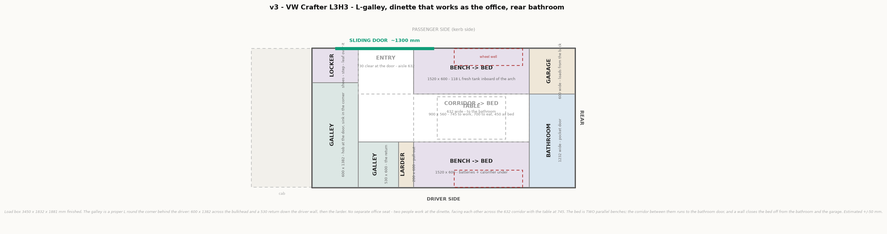

# v3 — VW Crafter L3H3, L-galley, dinette that works as the office, rear bathroom

Started 2026-09-21. Reworked several times; current shape from 2026-09-22.
**Plan and 3D model — iterating.** No photoreal impressions yet.

Regenerate: `python plan.py v3` then `python model3d.py v3`, from the project root.

Same van and cab as v2 (Crafter L3H3, 3-seat cab, partition at x = 0). Order down the driver
side, back to front: **bathroom + garage · bed · larder · galley.**

## The 3D model

**Viewer: [v3 Crafter](https://claude.ai/artifact/53pg4zZh6jgR2B4MFKnLHJ)** — drag to orbit,
scroll to zoom. Also written locally to `v3/viewer.html`, `v3/model.obj` and `v3/3d/*.png`. Everything in it is
extruded from the box list in `plan.py`, so the model cannot disagree with the drawing above.

| Layer | What it holds |
|---|---|
| Bed made up | the corridor infilled to 1520 × 1832; hides the table and its post |
| Bathroom door shut | the pocket-door leaf out of its pocket, closing the 600 across the corridor |
| Galley leaf up | the pull-up leaf over the shoe locker at worktop height; off, it hangs folded down the galley's end panel |
| Lockers | three overhead runs, kept clear of the door head and the windows |
| Appliances | the kit at real catalogue sizes, and it ghosts the carcasses so you see in |
| Body + glass | panels with real holes: slider, four windows, the cassette hatch, two fans, the partition with its pass-through over the shoe locker, and **the wall between the bed and the rear rooms** |
| Cab + seats | the 3-seat cab, dash, wheel, and the four road wheels |
| Schema overlay | the plan itself painted onto the model |
| Sizes | every block labelled with its name and size in mm |

`model3d.check()` passes on all **15 appliances**: each one inside the van, inside a carcass,
clear of its neighbours, and clear of the tyres. Three results worth keeping:

- **Nothing overlaps a wheel arch at all.** Not one warning — a first for this project. The
  galley ends at x 1430 and the arches start at 1863, so no appliance is even near one. It is
  what lets the fridge be a 90 L drawer instead of v2's hinged 90 L or v1's 70 L.
- **The batteries stop 17 mm short of the driver tyre.** The tyre runs x 1957–2669; the aft
  battery ends at 1940. Tight, and real.
- **The fresh tank sits exactly on the arch line.** Its outboard face is at y = 226, which is
  where the arch ends. Nothing to spare, nothing over.

`check()` also carries **two people at the dinette with laptops**, facing each other across the
corridor — trunk, thighs and shins each — and fails the build if any furniture runs through
them. That test exists because two rounds of v2's office table were drawn with a swing arm
through the sitter's chest before it was caught by eye, and it earned its keep again here: the
first draft of the seated pose put the passenger's shins 68 mm inside the bench carcass, where
the fresh tank lives, and the build refused.

What it now proves, which is the whole question behind dropping the separate office seat:

| | |
|---|---|
| **Knee gap between the two of you** | **312 mm** — the shins stop well short of each other |
| **Thigh clearance under the table** | **275 mm** at the 745 setting — the minimum is 270 |
| Table | **900 × 560**, which is two laptops facing each other with room for a mug |

`check()` also gained a per-variant **`sit_ok`** list, because which boxes are allowed to touch
a seated person depends on the layout — here it is the benches they sit on and the cushions on
top of them, where v1 and v2 meant the shoe locker.

**Two tool changes the L needed.** The galley crosses the bulkhead, so its runs are turned 90°
from every run v1 and v2 were built on:

- `sink_wells()` gained an **axis**: the two bowls now sit side by side across the van, not
  along it. Without it a 600 mm-deep counter got two bowls stacked front to back.
- the registry gained a **yaw** table, a per-variant turn for a prop whose mesh was modelled
  on a run running the other way. Four kinds now carry one, read off the viewer:
  **LOCKER 90 cw, hob 90 ccw, fridge 90 ccw, oven 180.** The sign is worth writing down: the
  viewer does `rotation.y` with world X = van length and world Z = van width, so **+90 turns
  van +x toward the passenger wall — counter-clockwise seen from above**, the way the plan is
  drawn. Clockwise is 270.

**The bathroom is drawn as a carcass the viewer ghosts**, not built from panels the way v2's
shower was. v2 had a glass screen worth building; here the interesting things are inside —
the WC, the tray, the shower head — and a pocket door has nothing to draw when it is open,
because the leaf is inside the wall. So the door is one box, in its shut position, off by
default.

### Three numbers the 3D corrected

- **WC knee room is 662 mm, not 782.** A 420 × 570 cassette against the driver wall leaves
  662 across the room, not the 782 estimated from a shallower pan. Still enough to sit.
- **The working height is 745, not 720.** At 720 with a 20 mm top the underside lands at 700,
  only 250 above a 450 seat. 745 gives the 275 of thigh clearance that is the minimum.
- **The seated pose had to be redrawn before it told the truth.** The first version put the
  passenger's shins 68 mm inside the bench carcass — where the fresh tank is — and the build
  refused. Shins drop *from* the bench edge into the corridor; they do not start behind it.

## The shape in one line

**Two parallel benches, not a U** — and the 632 mm gap between them is a corridor that runs
from the galley straight to the bathroom door. At night the table drops and that corridor
becomes the middle of the bed.

| | Day | Night |
|---|---|---|
| The gap between the benches | **corridor, 632 wide**, to the bathroom | **the middle third of the bed** |
| The table in it | folds and slides out of the way | dropped to 450, cushions over |
| Bathroom | walk to it | cross the bed to it |

This is the fix for the problem the fixed-bed version had: with a permanent full-width bed,
the bathroom behind it could **only** ever be reached by climbing over. Now it is a normal
walk all day, and only a night trip costs anything.

## The budget closes to the millimetre

| Driver side | mm |
|---|---|
| Galley, across the bulkhead | 600 |
| Galley, the return | 530 |
| Larder | 200 |
| Bed / dinette | 1520 |
| Bathroom + garage | 600 |
| **Total** | **3450** = the van |

**The separate office seat is gone, and its 450 mm paid for two things.** A 450 × 400 perch
with its own little table next to a dinette that already seats two was one seat too many — so
the galley return grew from 180 to **530**, which turns a token corner into a real second leg,
and the rear block grew from 500 to **600**, which is the shower.

| | before | now | |
|---|---|---|---|
| Galley | 0.94 m² | **1.15 m²** | +22 % over v2 |
| Bathroom | 0.62 m² | **0.74 m²** | +19 % |
| Entry clear at the door | 830 | **730** | −100, the cost |

The entry is what paid for the shower: the bed had to move 100 mm forward to give the rear
block its extra depth. 730 is still the widest entry of any version except v1's empty one.

## Front, x 0–1330 — the L-galley and the larder

| Piece | Size (mm) | Holds |
|---|---|---|
| **Galley, long leg** — across the bulkhead | **600 × 1382**, worktop 900 | hob at the door end, **90 L drawer fridge** under it, **sink in the corner**, oven and pump under |
| **Galley, return** — down the driver wall | **530 × 600**, worktop 900 | free counter, the drainer end |
| Galley leaf | **600 × 450** at 900 | pulls up over the shoe locker |
| Shoe locker | **600 × 450**, top 450 | shoes; the step to the cab, pass-through over it |
| **Larder** | **200 × 600**, full height 1881 | ~0.23 m³ — a **tandem pull-out**, 200-wide front onto the aisle, 600-deep baskets |
| Aisle | **632** | runs straight into the corridor |
| Entry clear at the door | **730** | of the 1300 aperture |

**Galley 1.15 m²** — 0.83 across the bulkhead and 0.32 in the return. That is **+22 % on v2**
and the most of any version with a bathroom in it.

**The galley leaf crosses the cab pass-through when it is up.** The pass-through sits over the
shoe locker and the leaf lands at 900, straight through it. Same trade v2's worktop leaf made
against the sliding door: it is only while you are actually cooking, and it folds in a second.
Worth feeling before it is built.

**The cab pass-through moves to the passenger corner**, over the shoe locker — the galley owns
the driver corner now, which is the whole point of the L.

## The office is the dinette

There is no separate work seat. Both of you sit at the bed benches, facing each other across
the corridor, with the table up at **745**.

| | |
|---|---|
| Table | **900 × 560** on a telescopic pedestal — **745** to work, **700** to eat, **450** as the bed's centre panel |
| Seats | the two bed benches, 600 deep, top 450 |
| Knee gap between you | **312 mm** — measured, not assumed |
| Thigh clearance | **275 mm**, against a 270 minimum |
| Daylight | a window over each bench |

**Why this is better than the perch it replaces.** A 450 × 400 seat with its own 400 × 360
board, wedged between the larder and the bed bench, was a second-class place to spend eight
hours — and it sat next to a dinette that already seats two properly. Deleting it bought a
real galley return and a bigger shower.

**Why a floor pedestal and not a swing arm.** v2 drew two swing-arm office tables straight
through the sitter's chest before it was caught by eye. A top on a floor pedestal cannot do
that, and `check()` now carries both sitters to prove it.

**The fridge is a 90 L drawer and it dodges nothing.** The wheel arches start at x 1863; the
galley ends at 1430. No appliance in this van sits over an arch. That fixes v2's open item #4
(a 530 mm hinged door swinging into a 632 aisle) and gets 20 L back at the same time.

**Galley 0.94 m² — v2 exactly** (0.83 in the long leg, 0.11 in the return), with no fold-down
leaf blocking the door while you cook.

## Middle, x 1330–2850 — the split bed

| | Size (mm) | Holds |
|---|---|---|
| Bench, driver | **1520 × 600**, top 450 | batteries, inverter, calorifier |
| Bench, passenger | **1520 × 600**, top 450 | **118 L fresh tank**, inboard of the arch |
| Corridor between | **1520 × 632** | the table, and the walk to the bathroom |
| Table | **900 × 560** | 745 to work at, 700 to eat at, 450 as the bed's centre panel |
| **Bed made up** | **1520 × 1832** | **760 each for two**, 507 for three |
| Headroom over the bed | 1431 | |

**Why two benches and not a U.** A U needs a third bench across the back — and the back is now
the bathroom and the garage. Two parallel benches leave the middle open, and that open middle
is what the bathroom needs to be reachable.

**The table has to lift off.** Parked in the corridor it blocks the walk to the bathroom, so
the top comes off its pedestal and stands in the garage when the run aft matters.

**The conversion.** Lift the top off, drop the pedestal to 450, put the top back, lay the
centre cushions. Under a minute, and only the middle 632 mm ever changes — the two benches are
already at bed height.

## Rear, x 2850–3450 — bathroom beside a garage

The back is **600 mm deep** — 100 more than the first draft, which is where the office seat's
length went — and **split**, not full width:

| | Size (mm) | |
|---|---|---|
| **Bathroom**, driver side | **600 × 1232** = 0.74 m², 1881 clear | sit-down shower **and** a permanent cassette WC |
| **Garage**, passenger side | **600 × 600**, full height 1881 ≈ 0.68 m³ | loads through the **rear door** |

**The extra 100 mm is all shower.** The WC's knee room is set across the room, not along it, so
it stays at 662; what grows is the standing and sitting space in front of the tray, and the
tray itself. 0.74 m² against v2's 0.56 is **+32 %**.

**A real pocket door fits here, and that is why the bathroom is this width.** The bathroom's
forward face is 1232 long: a 600 mm door plus a 632 mm pocket is exactly 1232. Nothing
surface-mounted, nothing swinging into the corridor.

**The WC stays put — no sliding drawer.** At 1232 wide the room holds both. The cassette sits
at the driver end facing across, which gives **662 mm of knee room**; the shower is the other
end, with a fold seat on the passenger wall and the whole 1232 for your legs when seated. v2
had to slide its WC in and out of a 700 × 800 cubicle; this one does not.

**The garage is full height, so it can hang clothes.** 600 wide × 600 deep is enough for a
rail across the width (hangers are ~430). Half rail, half shelves, loaded from the back —
that closes the "nowhere to hang anything" gap the earlier drafts had.

## Water, weight and services

| Service | Where |
|---|---|
| Fresh tank 118 L, 1020 × 374 × 310 | passenger bench, **inboard of the wheel arch**, x 1800–2820 |
| Batteries + inverter | driver bench, forward end, inboard of the arch |
| Calorifier | driver bench, aft end — next to the bathroom wall |
| Oven, pump, filter | under the sink |
| Grey | underslung |
| Cassette hatch | driver-side rear quarter panel, x ~2900–3320 |

**The tank is v2's tank again, with v2's problem.** 1020 × 374 × 310 is a semi-custom size, and
sitting at x ≈ 2310 it puts about **100 %** of its weight on the rear axle (rear axle ≈ x 2313).
Options, all open: have one made, plumb two slim off-the-shelf tanks in series, or cut it to
~90 L and move it forward into the bench's front third. See open item 3.

## v3 against v2

| | v2 | **v3** | |
|---|---|---|---|
| Bed | 1520 × 1832 across, rear | **1520 × 1832 across, middle** | same |
| Bed made from | rear U | **two parallel benches** | corridor survives |
| Bathroom reachable by day without crossing the bed | yes | **yes — the corridor** | = |
| Bathroom | 700 × 800 = 0.56 m² | **600 × 1232 = 0.74 m²** | +32 % |
| Bathroom door | glass screen off the lobby | **pocket door** off the corridor | better |
| WC | slides in from a drawer | **permanent** | simpler |
| Galley | 0.94 m² with a fold-down leaf | **1.15 m², a real L** | +22 % |
| Fridge | 90 L hinged, over the arch, blocks the aisle | **90 L drawer, no arch** | better |
| Work position | none | **the dinette, table at 745, two people** | new |
| Hanging space | wardrobe 450 × 600 | **garage rail, 600 × 500 full height** | ≈ |
| Garage | rear bench 1.10 m², ~400 clear ≈ 0.44 m³ | **0.68 m³ full height** + 2 benches under the bed | +55 % |
| Galley shape | two runs across the aisle | **L into the corner behind the driver** | |
| Entry clear at the door | 690 | **730** | +40 |
| Travelling seats | 3 | 3 | = |

## Open on v3

1. **Night trip to the bathroom.** By day the corridor works. At night the bed is full width,
   so the aft sleeper rolls off straight into the bathroom and the forward sleeper crosses
   ~760 mm of their partner. Better than a fixed bed, not free.
2. **One top doing three jobs.** 700 to eat at, 745 to work at, 450 as the bed panel — a
   telescopic pedestal with three clamp positions, and somewhere to park the top while the
   corridor is in use. Mock it before it is built; it is the part most likely to annoy daily.
3. **Fresh tank.** Semi-custom shape and 102 % on the rear axle. Decide between a made-to-fit
   tank, two slim tanks in series, or 90 L moved forward.
4. **Bathroom 500 deep.** Fine seated, tight standing. Stand in a 500 mm gap before agreeing.
5. **Garage 600 wide.** Confirm what actually has to go in it — if it is only clothes, a rail
   and two shelves; if bulky gear, it may want to be wider at the bathroom's expense.
6. **The table at 745 over a 450 seat.** That is 270 mm of thigh clearance — the minimum. Sit
   at a 745 desk on a 450 chair before agreeing.
7. **Aisle 632** — two people still cannot pass in the galley, and the table blocks the walk
   to the bathroom until you lift the top off.
8. **Driver seat swivel.** A 3-seat front never blocked the *driver* side — the double bench
   cannot swivel in any van, but it is on the other side of the cab and is not in the driver
   seat's way. If it works, the swivelled seat replaces the 450 × 400 bench at no cost in floor
   (knees land inside the same 450) and gives a far better chair for an eight-hour day. The
   blockers are the handbrake lever (lowering kit) and an open driver-side partition. **Worth
   answering when the van is chosen: lever or electronic parking brake?**
9. **The sink is a placeholder.** Cut down to **340 × 560** — smaller and narrower than the
   first draft's 440 × 640 — but no real product chosen yet. The 200 mm of counter it frees
   between the bowls and the bulkhead is where both taps now stand.
10. **The larder has to be a pull-out, not a cupboard.** Its two wide faces are boxed in — the
   galley return forward, the bed bench aft — so the only face that can open is the narrow
   one onto the aisle: a 200-wide front with 600-deep baskets, which is a real tandem larder
   product. The aisle is 632, so a 600-deep basket clears when it is out. The generated prop
   still carries a door on its wide face (turned aft, so it at least does not open into the
   galley return); regenerating it with the narrow face named as the front is a future round.
   Written up in [doc/README.md](../doc/README.md#the-larder-2026-09-22--say-which-face-is-the-front).
11. **The fridge prop is a box without a front.** `fridgedrawer` was adopted from trellis on
   its shape error (0.16 against rodin's 0.17), and only afterwards did a geometric probe show
   trellis has no flat drawer front while rodin does. The two tie inside the noise on
   proportions, so rodin is the better mesh and the swap is one command:
   `python props.py pick fridgedrawer rodin`. Written up in
   [doc/README.md](../doc/README.md#the-shape-error-cannot-see-a-missing-feature-2026-09-22).
12. **The galley leaf against the cab pass-through.** Up, the leaf crosses it. Decide whether
   that matters or whether the leaf should stop at the locker's own width.
13. **No photoreal impressions yet.** `impressions.py` has not been run on v3.

**The pocket door stays a coloured box, on purpose.** Its slot is 40 × 600 × 1881 and the
viewer stretches a mesh to fill its box, so any door leaf becomes a flat slab — which is what
the box already looks like. The only thing a mesh would add is a recessed finger pull. The
prompt is written in `props.py` if we ever change our mind; nothing else is.
