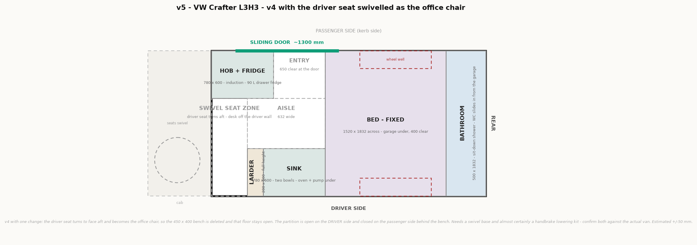

# v5 — v4 with the driver seat swivelled as the office chair

Started 2026-09-22. **Plan only — geometry not yet checked in 3D.**

Regenerate: `python plan.py v5`, from the project root.

**v5 is [v4](../v4/README.md) with exactly one change.** The 450 × 400 office bench is
deleted; the driver seat turns round to face aft and does that job instead. That 450 mm of
floor stays open.

Read v4's README for everything else — bathroom, bed, garage, galley, larder, services and
the open items are all identical.

## Does a 3-seat front stop the driver seat swivelling?

**No.** The two are on opposite sides of the cab.

| | |
|---|---|
| Double passenger bench | **can never swivel**, in any van. It is too wide to turn in the cab, and its belt anchorages run through the seat frame into the floor |
| Driver seat | **a normal single seat on a normal single base.** The bench beside it is not in its way |

So "3 seats in the front" only ever ruled out swivelling the *passenger* side. It never ruled
out the driver. v2 dropped both together, and that was one decision too many.

### What actually blocks it on a Crafter

| Blocker | Fix |
|---|---|
| **Handbrake lever** between the seat and the tunnel | a handbrake lowering / drop-down kit. This is the usual one and it is a real cost and a real job |
| **Seat rises** on the swivel base, typically 30–80 mm | changes the driving position and the headroom. Check with the base you actually buy |
| **The partition** at x = 0 | must be **open on the driver side**. Closed on the passenger side behind the bench |
| Steering wheel | slide the seat fully back before turning — normal practice |

**Confirm before ordering:** whether the trim you buy has a lever handbrake or an electronic
parking brake (which removes the problem entirely), and the exact rise of the base. v2's
README already had "does the Crafter have an electronic parking brake" as an open question —
it is now worth actually answering, because it decides this.

## What swivelling buys, and what it costs

**It costs no floor.** The swivelled seat's knees land around x 200–300 and the feet by about
x 400 — inside the same 450 mm the bench used. So the geometry of the whole van is unchanged:
bed 1520, galley 0.94 m², larder 200, entry 650, bathroom 500.

| | v4 — bench | **v5 — swivel** |
|---|---|---|
| The chair | 450 × 400 plywood bench, flat cushion | **the driver's own seat** — armrests, backrest, suspension, height and rake adjustment |
| Floor cost | 450 of length, 400 of depth | **450 of length, nothing else** — it is open floor |
| Storage under the seat | batteries + inverter | **gone** — batteries move into the garage |
| Desk | folds off the partition | folds off the **driver-side wall** — the partition is open there now |
| Partition | full, with a pass-through | **driver side open**, passenger side closed |
| Extra parts | none | swivel base + handbrake kit |
| Extra risk | none | the handbrake question |

**For a working day, the chair is the whole point.** [about-us](../doc/about-us.md) says the
van has to be a functioning office five days a week — that is the heaviest daily demand on
this build. Eight hours a day on a 400 mm plywood bench against a flat wall is not that. A
proper seat with a back and armrests is.

**The one real loss is thermal.** An open driver-side partition means the cab is part of the
living space: more glass, more cold bridge, and the cab's own heat in the sun. We are chasing
warm weather, so it is mostly a summer problem — a decent windscreen cover and a driver-side
curtain handle it. But it is not free.

**Batteries move to the garage.** The bench they lived under is gone. They go in the
under-bed garage with the calorifier, which is a better place for cable runs and a slightly
worse one for axle load.

## Recommendation

**Try for the swivel.** It costs nothing in floor and everything in comfort, and comfort at
that seat is the thing this van exists for.

But it depends on one fact we do not have yet: **the parking brake on the trim we buy.**
So the sequence is:

1. Find out whether the Crafter trim we are buying has a lever or an electronic parking brake.
2. Electronic → build **v5**, no handbrake kit needed.
3. Lever → price the lowering kit. If it is acceptable, still **v5**.
4. If neither works out → **v4** is the fallback and loses nothing but the chair.

Both versions are drawn, so the decision does not block anything else.

## Open on v5

Everything open on [v4](../v4/README.md#open-on-v4), plus:

1. **Parking brake: lever or electronic?** This decides v5 against v4. Answer it when the van
   is chosen, not after.
2. **Swivel base rise.** 30–80 mm changes the driving position — Ondrej is 171 cm, so check
   headroom and pedal reach on the actual base.
3. **Desk mounting moves to the driver-side wall.** A fold-down board there hangs over the
   seat's turning circle when stowed — check the two do not foul.
4. **Open driver-side partition.** Decide the curtain or screen that closes it for heat and
   for privacy at night.
5. **Turning circle against the larder.** The seat sweeps as it turns; the larder starts at
   x 450. Confirm the sweep clears it with the seat slid back.
6. **Travelling seats stay 3.** Nothing here changes the registration case.
